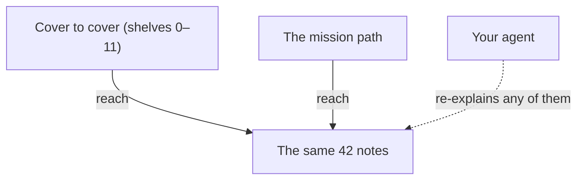

**The idea in one line:** forty-two short notes, two ways through them,
and one trick: your agent can re-explain any of them.

These notes are the ideas behind Agent School, Deployed's agent
engineering program. They are written for someone who has never used a
model or called an API, and has no reason to feel behind.

Each note answers one question you might actually ask, in about five
minutes. There are forty-two, in eleven clusters. They run from what an
AI model does when it answers you, to how you present a finished system
to someone who will never read your code.

## Two ways through

- **Cover to cover.** The clusters are shelves, grouped by topic. Early
  shelves give you words the later ones lean on.
- **The mission path.** As you move through the missions, your mentor
  skill points at each note when the problem it answers shows up in your
  own work.

Hit a surprise bill in the warm-up and the note on tokens turns up.
Build a pipeline that fails quietly in Project 2 and the note on failing
loudly shows up. The path deliberately cuts across the shelves. It runs
like this:

- **Week 0:** 0-1 · 1-1 · 1-2 · 3-1 · 3-2 · 3-3 · 3-4
- **Warm-up:** 6-1 · 8-1
- **Project 1:** 1-3 · 2-1 · 2-2 · 4-1 · 4-2 · 6-2 · 7-1 · 7-2
- **Project 2:** 4-3 · 4-4 · 6-4 · 6-5 · 7-4 · 8-2 · 9-2 · 10-1 · 10-2
- **Project 3:** 5-1 · 5-2 · 5-3 · 5-4 · 7-3
- **Project 4:** 2-3 · 6-3 · 7-5 · 9-1 · 9-3
- **Capstone:** 7-6 · 8-3 · 8-4 · 10-3 · 11-2 · 11-3
- **Every project ends with:** 11-1

> Reading a note right when you need it sticks far better than reading
> it in advance. Skipping ahead and coming back works too.

## What every note looks like

Every note follows the same beats, so you always know where you are:

1. A question as the title, one you might ask out loud.
2. **The idea in one line**, then a short concept in plain words with
   exactly one analogy.
3. A diagram of how the idea works.
4. A real-world example: a story that happened to us in production,
   including what it cost. Mistakes we admit teach more than lessons we
   polish.
5. A two-minute experiment you can run in any AI chat, with no setup and
   no keys.
6. A short note on what this means for the thing you are about to build.
7. A "Check yourself" question you answer before opening the reveal.

Do the experiment. It is the cheapest way to turn "I read about it" into
"I've seen it happen."

## The trick that makes them yours

These notes live as plain files in your own course repo, next to your
project. That means your **agent**, the AI assistant working alongside
you, can read them too.

Open any note and ask it to:

- explain the idea again using your project as the example
- try a different analogy if mine did not land
- quiz you, or argue the opposite side so you find the holes

A note is a starting point. The version that matters most is the one
your agent rebuilds around the thing you are making.

Start with whichever question is nagging you most.
