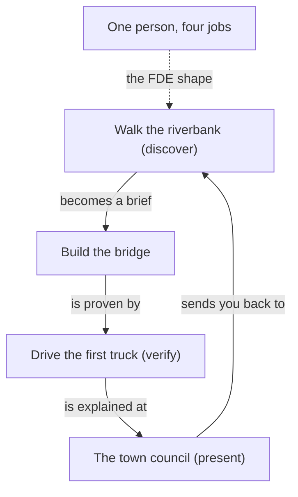

**The idea in one line:** a forward-deployed engineer owns the whole loop, from understanding the problem to explaining the result.

A **forward-deployed engineer**, or FDE, works at the customer's side of the table instead of behind a wall at the vendor. The name comes from military **forward deployment**: put people near the problem, not near headquarters.

In practice the FDE does four jobs:

- takes a business problem
- builds something that solves it
- proves that it works
- explains it to the people who pay for it

One person or one small team, no handoffs.

That last part makes the role strange. Most software work moves down an assembly line. One person talks to the customer, a second designs, a third codes, a fourth tests.

Each handoff loses a little of what the customer actually said, like a message whispered down a line of people. An FDE shortens the line to nothing.

Here is the analogy. Picture an engineer who builds a bridge, and who also walked the riverbank for a week first, asked the villagers where they cross when the water is high, drove the first truck over on opening day, and then told the town council whether it was safe.

> A perfectly built bridge in the wrong place is still a useless bridge, and only the person who walked the riverbank would have known.

## Real-world example: the posting that said Remote

Deployed, the job board this course runs on, was built in exactly this shape. One small feature shows the whole loop.

Here is a real posting: "Senior Backend Engineer. Remote." Sounds open to the world. Read to the bottom and a quiet line says the company can only employ people in one country. A job seeker in Pune finds that line after an hour of writing the application, or worse, never hears back and never learns why.

**The riverbank walk.** Sitting with job seekers' actual question taught us it was never "what jobs exist?" They carry a sharper one: "can I, from where I sit, actually get this job?" No board we found answered it.

**The bridge.** So that question became a field a database can hold: who can apply, and from where. A pipeline now reads thousands of postings every night and fills that field in, posting by posting.

**The first truck over.** The same people then pulled up rows and read the original posting beside the pipeline's answer, by hand, fifty at a time. A pipeline that is quietly wrong is worse than no pipeline, because it answers the seeker's question with false confidence.

**The town council.** And the same people presented it: a filter on the site a seeker can click, and page copy where every count renders from the live database, because a hand-typed number is a promise nobody is checking.

One loop, one pair of shoes, four jobs. The cost was real: when a number looked wrong, there was no upstream team to blame and no downstream team to catch it. The builder had to be the doubter. That is slower in week one. It is also why the misunderstandings that normally surface months later, when someone finally sees the finished product, surfaced while they were still cheap to fix.

The code was never the hard part. The hard part was understanding one reader's question well enough that the code had a chance of answering it.

## See it yourself (2 minutes)

Open any AI chat and paste this:

> I want to build a tool that helps small shops track their inventory.
> Before you suggest anything, ask me the ten questions an engineer would
> need answered to avoid building the wrong thing. Do not write any code.

Notice how few questions are technical: who counts stock, when, what goes wrong today, what a mistake costs. Answer two honestly and watch your picture shift. That shift is the work.

## What this means when you build

Across the program you will do all four jobs in every project:

- interview the problem
- build the system
- verify it against a measure you wrote down before you started
- present it in plain words

Your mentor skill pushes you toward verifying and presenting, because that is where most beginners stop early. When a mission has less coding than you expected, that is intended. The code earns you the right to the other three parts.

## Check yourself

You show a client a flawless working tool and they say, politely, that it solves the wrong problem. Of the four FDE jobs (interview the problem, build, verify, present), which one most likely got skipped?

Decide on your answer, then open

Interviewing the problem. A tool can be built and verified perfectly and still point at the wrong target, which is the bridge in the wrong place. Only someone who walked the riverbank, meaning sat with the problem first, would have caught it.

