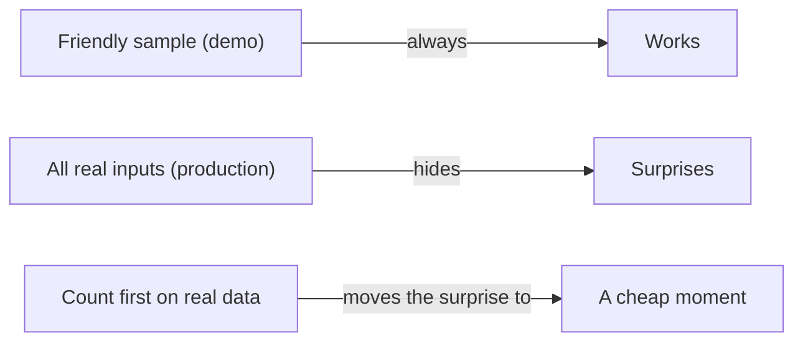

**The idea in one line:** a demo runs on examples you picked; production runs on everything, so count on real data before it matters.

Every AI demo works, and the reason is selection. The builder picks a few examples, tweaks the instructions until they behave, and shows the ones that came out well.

Nothing dishonest happened. But the examples were chosen by someone who already knew roughly what would work. They say very little about the thousand examples nobody chose.

Two words help here:

- The **sample** is the small set you looked at.
- The **population** is everything the system will eventually meet: malformed entries, odd formats, edge cases you never saw.

A demo describes the sample. Production lives in the population.

You cannot close the gap by being careful or clever. You can only measure it, by running your system on real data before it matters and counting what happens.

Here is the analogy. Passing a driving test in an empty car park proves you can steer. It says almost nothing about rush hour in a city you have never visited, with buses, cyclists, and a delivery van stopped in the road.

> The gap between sample and population is where surprises are stored. You only choose how expensive they are.

## Real-world example: the rule that matched 8,021 rows

Our pipeline classifies job postings. For some, it sends the job for a second, more expensive look, where a bigger model reads it more carefully. We wrote an escalation rule to pick only the postings that deserved it. On paper it read sensibly.

Before running it for real, we did a **dry run**: ask the rule how many rows it would send, without sending any. The count came back at 8,021. Only 151 actually qualified.

The rest were jobs located in India that the rule was supposed to ignore. It matched them because of how it treated their location data. That is roughly fifty times more rows than we intended.

Nothing went wrong in the end, because the check ran against real data before any spend. We caught it for the price of reading one number.

Had we launched on how the rule looked, the first signal would have been a bill for thousands of needless second looks. The rule looked just as sensible on the day we ran it, and was just as wrong.

## See it yourself (2 minutes)

Open any AI chat and paste this:

> Here is a rule: "flag any customer message that mentions a refund."
> Invent twelve realistic customer messages, including some tricky ones,
> and tell me which the rule would flag. Then tell me which flags would be
> wrong and which real refund requests it would miss.

Look at the tricky ones: "I don't want a refund, I want it fixed," or "refunds policy link broken."

A rule that sounded complete in one sentence leaks in both directions the moment real-looking text touches it. You just built a very small production test.

## What this means when you build

In Project 1, before you build anything, you write down what you expect the system to do on real data, then compare it with what it did.

- Do the count first. Before any step that costs money or touches people, run the cheap version that only counts.
- Ask whether the number is the one you predicted.
- If it is off by a lot, the surprise has moved to a moment when it costs almost nothing.

## Check yourself

Your escalation rule was meant to send 151 postings for a second, expensive look. A dry run says it would send 8,021. Roughly how many times over budget would you have been, and what did catching it cost?

Decide on your answer, then open

About fifty-three times over, which matches the note's "roughly fifty times more rows than we intended." Catching it cost the price of reading one number from a count-only run. Launching on the strength of how the rule looked would have meant finding out from the bill.

