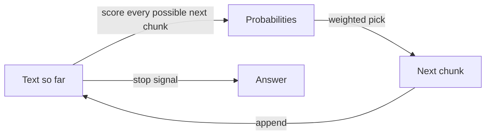

**The idea in one line:** a model predicts the next chunk of text, over
and over. Everything else about AI follows from this one trick.

When an answer streams back at you, it feels like something is
thinking and looking things up. What actually happens is smaller and
stranger:

- The model looks at everything written so far.
- It picks a likely **next chunk** of text.
- It adds that chunk and repeats.

A few hundred repetitions later, you have an answer. That is the
entire loop. This kind of system is called a **large language model**,
or LLM, and "predict what comes next" is the whole job description.

How can something so simple write working code or explain tax law?
Training. The model was shown a staggering amount of human writing,
and at every point it had to guess what came next. Billions of wrong
guesses, each one nudging its internal settings, forced it to absorb
how the world's text actually goes. You can't guess the next sentence
of a chemistry explanation without absorbing some chemistry.

Here's the analogy. Picture someone who has read every recipe ever
written and never tasted anything. Hand them a card that says "Slice
the onions thin, then heat the oil until" and they'll finish it
fluently: "shimmering, add the onions." Now hand them the start of a
recipe for a dish nobody has ever cooked. They'll write one that
sounds exactly as convincing. Same fluency, same confidence, no
tongue.

That picture carries the one fact to keep forever:

> A model optimises for **plausible**, which overlaps with **true**
> only where the truth was well represented in its training. When it's
> guessing, nothing inside it rings an alarm. The guess arrives in the
> same confident tone as the facts.

People call this **hallucination**. "Fluent guessing" describes it
better. Good engineering is mostly arranging things so the model's
fluency gets used and its guessing never gets the chance to hurt
anyone.

## Real-world example: the labels that invented themselves

Our job board sorts thousands of postings a night: what kind of work,
how senior, which regions can apply. The cheapest step runs on a
small, inexpensive model, and early on we let it answer in its own
words.

It kept inventing categories. Nothing was malfunctioning. Fluent text
keeps finding new ways to say things, so we got a spread of labels
nobody had planned, and none of them matched our database.

The fix: that step now **picks from a fixed list we write** instead of
composing an answer. We removed the part of the job where fluency
causes damage, and kept the part where it shines, which is reading a
messy posting and judging which option fits.

## See it yourself (2 minutes)

Open your agent, or any AI chat, and send this:

> Tell me about the 1987 Lisbon Accord on international cheese
> labelling, and who signed it.

There's no such accord. Watch what you get: names, dates, a tidy
summary. Then follow up:

> Did that accord actually exist? How sure are you?

Some models catch it, some don't. Either way, you've watched the loop
work: given the shape of a question about a treaty, it produced the
text that usually follows such questions.

## What this means when you build

Two habits, from day one:

- **Supply the facts in the prompt** instead of asking the model to
  recall them. Recalled facts are guesses; supplied facts are material.
- **Offer options instead of asking for compositions** where you can.
  A pick from a list has a checkable answer. A free-form paragraph has
  only a plausible one.

## Check yourself

Why do we make our cheapest classification step pick from a fixed list
instead of answering freely?

Decide on your answer, then open

Free-form answers are fluent, and fluency keeps inventing new labels
that match nothing in the database. A fixed list keeps the model's
judgment (which option fits this posting?) and removes its ability to
improvise, so every answer is one a program can count and compare.

