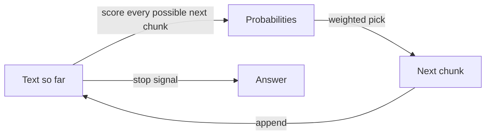

When you type a question into an AI chat and an answer streams back, it
feels like something is thinking, looking things up, and composing a
reply. What actually happens is smaller and stranger.

The model predicts the next chunk of text. It looks at everything written
so far, picks a likely next piece, adds it to the text, and then does the
same thing again with the slightly longer text. A few hundred repetitions
later, you have an answer. That is the entire loop. The technical name for
this kind of system is a large language model, or LLM, and "predict what
comes next" is the whole job description.

A reasonable reaction is to doubt that something so simple could write
working code or explain tax law. The answer lies in how it was trained.
Before you ever met it, the model was shown a staggering amount of human
writing: books, manuals, forum arguments, source code, recipes, court
records. At each point in each text, it was asked to guess what came next,
and each wrong guess nudged its internal settings a tiny amount. Billions
of nudges later, the settings had to encode a lot about the world, because
you can't guess the next sentence of a chemistry explanation without
absorbing some chemistry. Prediction works as a pressure that forces
learning.

Here's the analogy. Picture someone who has read every recipe ever
written, in every cuisine, and who has never tasted anything. Hand them a
card that says "Slice the onions thin, then heat the oil until" and ask
them to keep writing. They'll finish it fluently: "shimmering, add the
onions and cook until golden." They know how recipes go. Now hand them the
start of a recipe for a dish nobody has ever cooked, and they'll write one
that sounds exactly as convincing. Same fluency, same confidence, no
tongue.

That's the model, and it sets up the one fact you most need to carry
forward. A model optimises for what is plausible, which overlaps heavily
with what is true when the truth was well represented in its training.
For something obscure, recent, or private to your company, the plausible
continuation still arrives in a perfectly confident tone, and it may be
wrong. Nothing inside the model rings an alarm when it's guessing. People
call this hallucination, though "fluent guessing" describes it better.

So the model is genuinely useful and genuinely unreliable at once, and
good engineering is mostly about arranging things so the first quality
gets used and the second never gets the chance to hurt anyone.

## This happened to us

Our job board sorts thousands of postings into categories: what kind of
work is this, how senior is it, which regions can apply. For the cheapest
part of that work we use a small, inexpensive model. Early on, the natural
approach was to let it answer in its own words.

It kept inventing categories. Nothing was malfunctioning. Asked to
describe a job freely, a model produces fluent, reasonable text, and
reasonable text keeps finding new ways to say things. The result was a
spread of labels nobody had planned, none of which matched anything else
in our database.

So the setup changed. The cheapest classification step now lets the model
pick only from a fixed list we write. It no longer composes an answer; it
selects one. We took the part of the job where its fluency causes damage
and removed it, and kept the part where it's good, which is reading a
messy posting and judging which option fits best.

## See it yourself (2 minutes)

Open your agent, or any AI chat, and send this:

> Tell me about the 1987 Lisbon Accord on international cheese labelling,
> and who signed it.

There's no such accord. See what you get: names, dates, a tidy summary.
Then follow up with:

> Did that accord actually exist? How sure are you, and what were you
> doing when you wrote the first answer?

Some models catch it, some don't. Either way, you've watched the loop
work: given the shape of a question about a treaty, it produced the text
that usually follows such questions.

## What this means when you build

In Week 0 you'll build your first agent, and everything it says to you
will come out of this loop. Two habits follow. First, put the facts in the
prompt rather than asking the model to recall them, because recalled facts
are guesses and supplied facts are material to work from. Second, where
you can, ask it to choose from options you wrote instead of composing from
scratch. A pick from a list has a checkable answer. A free-form paragraph
has only a plausible one.

## Check yourself

In the cheapest step of our job board pipeline, why do we make the model pick from a list we wrote instead of letting it answer in its own words?

Decide on your answer, then open

Left to answer freely, the model keeps producing fluent, reasonable text, and reasonable text finds new ways to say things, so our labels multiplied and matched nothing else in the database. A pick from a fixed list removes the part of the loop where fluency causes damage and keeps the part where the model is good: judging which option fits a messy posting.

