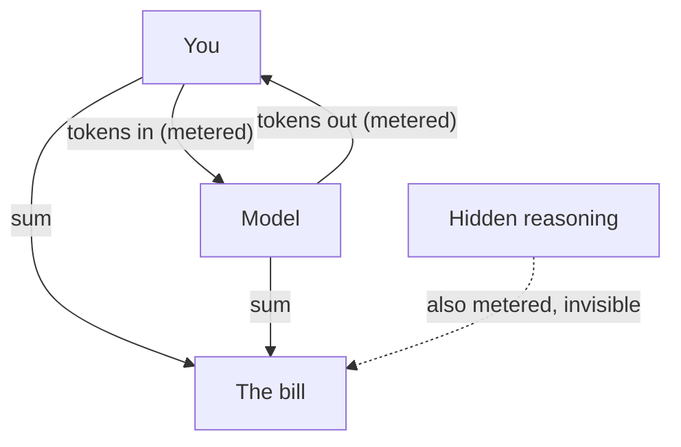

**The idea in one line:** models read and write tokens, you pay for every one in both directions, and some are invisible.

A model does not read words. It reads **tokens**: small chunks of text, usually three or four characters, sometimes a whole short word. "Engineering" might be two or three tokens. "The" is one. This note is roughly a thousand of them.

Why care about a unit you never see? Because tokens are what you pay for, in both directions:

- Everything you send to a model is counted and billed.
- Everything it says back is counted and billed again.
- The size of its memory is measured in tokens too, which the next note covers.

Here is the analogy. In the telegram era, messages were priced per word, and it changed how people wrote: "ARRIVING MONDAY" instead of "I expect to arrive at the station on Monday."

Tokens are the telegram words of AI, with two differences. The meter runs in both directions. And it is invisible unless you go looking for it.

> The meter runs on what you send and what comes back, and the worst charges are the ones you never see.



```interactive
widget: tokens
```

## Real-world example: the fifty-second job

Our job board classifies thousands of postings a night: is this job remote, which country can apply, how senior is it. We moved part of that work to a small, cheap model to save money. The task was simple, pick answers from a fixed list, and the model was more than capable.

Then we watched a single job get processed. Fifty seconds, for a task that should take five.

The model was spending around five thousand tokens per job on **hidden reasoning**, thinking out loud to itself before answering, as such models are tuned to do by default. None of it appeared in the output. None was needed for a pick-from-a-list task. All of it was billed. We were paying for an essay and receiving a single word.

One configuration line turned the hidden reasoning off. The same work became about ten times cheaper and ten times faster, with no change in the answers.

The model did exactly what it was configured to do. The failure was ours: nobody had looked at the meter until the slowness got loud enough to notice. Had the task been a little faster, we might have paid the tenfold for months.

## See it yourself (2 minutes)

Open your agent, or any AI chat, and paste a paragraph from anything you have handy. Then ask:

> Roughly how many tokens is the text I just pasted, and how many words?
> Explain the difference using my own text as the example. Then show me
> the same request I could have made in half the tokens.

Look at the ratio it reports, and at its shortened version of your request. You just did by hand what cost-conscious systems do by design.

## What this means when you build

Every agent you ship in this program has this meter running, and the gateway we give you reads it per mission.

- Before each build, write a prediction: what should this cost?
- Afterward, compare it with what it did cost.
- The gap between the two is where you find things like our fifty-second job.

By Project 2 you report cost per document next to accuracy, as one number employers can check.

## Check yourself

Suppose the classifier from the war story runs on 3,000 jobs a night, each burning about 5,000 hidden reasoning tokens. How many tokens are billed each night for reasoning nobody reads?

<details><summary>Decide on your answer, then open</summary>

About 15 million (3,000 x 5,000), all of it billed, for answers that were a single word. Turning the hidden reasoning off cut cost and time roughly tenfold with no change in the answers, which is why you look at the meter before the bill arrives.

</details>
