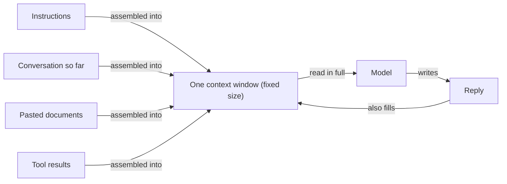

A model has no memory in the way you do. It doesn't carry yesterday around
with it, and it doesn't keep a running file on you. Each time it answers,
it works from one block of text, assembled fresh and handed over all at
once. Everything the model can consider lives inside that block. The block
is called the context window.

What goes in it? More than people expect. Your instructions go in. Your
question goes in. So does every earlier message in the conversation, any
document you pasted, any results a tool fetched, and, as it writes, the
answer so far. The window is measured in tokens (the tokens note covers
those), and every model has a maximum. Current windows are large enough to
hold a long book. They're still finite, and the cost of using them is
real, because you pay for everything in the window each time it's sent.

Here's the analogy. Imagine a meeting room with one whiteboard and a rule:
the person facing the board can only act on what's written there. Nobody
may bring notes, and nobody can phone a colleague. At the start of the
meeting, you write the brief up. As the discussion goes on, the board
fills. Once it's full, the only way to add something is to wipe something
else. After that, a question about whatever you wiped gets a puzzled look,
because as far as the person at the board is concerned, it was never said.

Notice what that doesn't describe: forgetting. The model doesn't forget the
way you forget a name. The wiped material is gone from its world, with no
fuzzy trace, no feeling of "I used to know this." That has three practical
consequences.

First, long conversations drift. When a chat gets long enough that early
messages are dropped or shortened by the software around the model, the
model will cheerfully contradict something you settled an hour ago,
because for it, nothing was settled.

Second, a fresh chat starts blank. Whatever you told it in one
conversation, it brings nowhere else, unless the product you use copies
notes into the new window for you.

Third, even inside the limit, more isn't automatically better. Models tend
to use the start and end of a long input more reliably than the middle,
and a window stuffed with loosely related text gives the model more places
to wander. A short, well-chosen window usually beats a long, careless one,
and costs less.



```interactive
widget: context-window
```

## This happened to us

Our enrichment step reads a job posting and fills in structured fields:
location rules, seniority, and so on. It runs on a small model, and a
small model has a smaller window. Our instructions take up part of it. The
posting has to fit in whatever remains.

Most postings do. Some don't: pages of company history, benefits
boilerplate, legal notices, all wrapped around the few paragraphs that
decide the answer. The obvious fix is to cut the text off wherever the
window runs out. That keeps whatever happened to come first, which is a
different thing from keeping whatever matters most, and the model would
never tell us it had been handed half a posting. A truncated input looks
complete from the inside.

So we trim by priority instead. When a posting is too long, the parts that
carry the most information are kept first, and the filler is what falls
away. The window is a budget, and we decide who gets spent from it before
the model sees anything.

## See it yourself (2 minutes)

Open a brand-new chat in your agent or any AI tool and send:

> My code word is "pelican". Please remember it.

Then open a second, separate new chat and ask:

> What's my code word?

It can't know, and that second chat is a fresh whiteboard. Now go back to
the first chat and ask it:

> List every kind of thing currently in your context window, and roughly
> how much space each takes up.

Compare its answer with what you've actually sent. You're looking at the
whole of what the model knows about you right now.

## What this means when you build

Every agent you build in this program has a window to budget: your
instructions, the tools' output, the documents you feed it, the history of
its own steps. A few missions in, you'll hit the moment where something
important quietly stops being in front of the model, and the symptom will
look like a model that got dumber. Before blaming the model, check what
was on the board. You'll also learn to decide, deliberately, what gets
written there first.

## Check yourself

A job posting is too long for the small model's window, and you can either cut it off where the window runs out or keep the parts that carry the most information. Which do you pick, and what goes wrong with the other?

<details><summary>Decide on your answer, then open</summary>

Keep the most informative parts and let the filler fall away. Cutting at the limit keeps whatever came first, which is not what matters most, and the model never signals that it received half a posting, because a truncated input looks complete from the inside.

</details>
