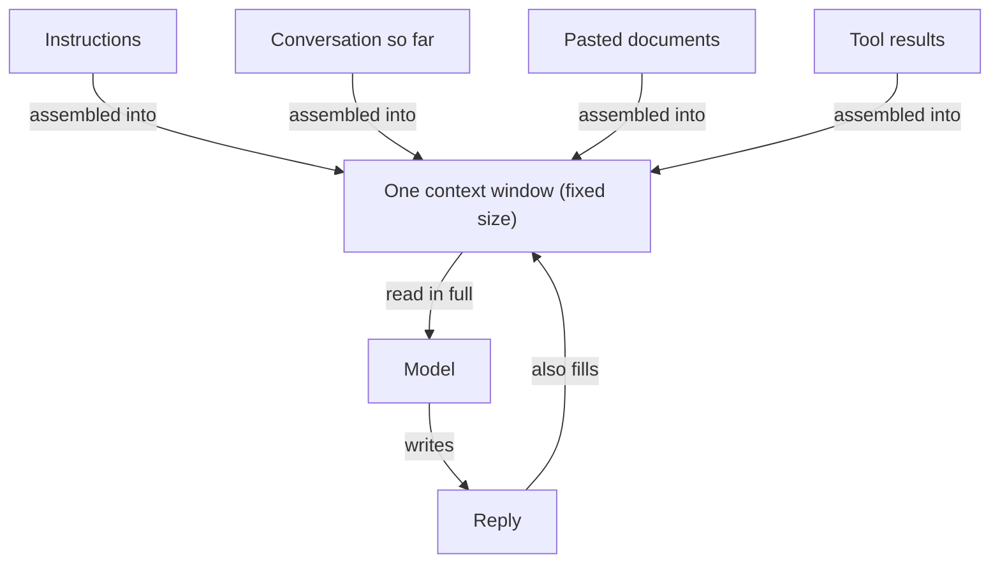

**The idea in one line:** a model sees only what is in its context window right now, and anything past the edge does not exist.

A model has no memory the way you do. It does not carry yesterday around or keep a file on you. Each time it answers, it works from one block of text, assembled fresh and handed over all at once. That block is the **context window**.

What goes in it is more than people expect:

- your instructions and your question
- every earlier message in the conversation
- any document you pasted, and any result a tool fetched
- the answer so far, as it writes

The window is measured in tokens (the tokens note covers those), and every model has a maximum. Windows can hold a long book but are finite, and you pay for everything in them each time they are sent.

Here is the analogy. Picture a meeting room with one whiteboard and a rule: the person facing the board acts only on what is written there. No notes, no phoning a colleague.

The board fills as discussion goes on. Once full, adding something means wiping something else. Ask about the wiped item and you get a puzzled look, because to them it was never said.

> The model does not forget the way you forget a name. Wiped material is gone from its world, with no trace.



```interactive
widget: context-window
```

That has three practical consequences:

- **Long conversations drift.** When early messages get dropped or shortened, the model cheerfully contradicts something you settled an hour ago.
- **A fresh chat starts blank.** Nothing carries over unless the product copies notes into the new window.
- **More is not automatically better.** Models use the start and end of a long input more reliably than the middle. A short, well-chosen window usually beats a long, careless one, and costs less.

## Real-world example: the posting that would not fit

Our enrichment step reads a job posting and fills in structured fields: location rules, seniority, and so on. It runs on a small model, which has a smaller window. Our instructions take part of it, and the posting must fit in what remains.

Most postings fit. Some wrap pages of company history, boilerplate, and legal notices around the few paragraphs that decide the answer.

The obvious fix is to cut where the window runs out. That keeps whatever came first, not whatever matters most. And the model never tells us it got half a posting, because a truncated input looks complete from the inside.

So we trim by priority. When a posting is too long, the parts carrying the most information are kept first, and the filler falls away. The window is a budget, and we decide who gets spent from it before the model sees anything.

## See it yourself (2 minutes)

Open a brand-new chat in your agent or any AI tool and send:

> My code word is "pelican". Please remember it.

Then open a second, separate new chat and ask:

> What's my code word?

It cannot know, because the second chat is a fresh whiteboard. Now go back to the first chat and ask:

> List every kind of thing currently in your context window, and roughly
> how much space each takes up.

Compare its answer with what you actually sent.

## What this means when you build

Every agent you build here has a window to budget: your instructions, the tools' output, the documents you feed it, the history of its own steps.

Soon something important will quietly drop out of the window, and it will look like a model that got dumber. Before blaming the model, check what was on the board. Then decide deliberately what gets written there first.

## Check yourself

A job posting is too long for the small model's window, and you can either cut it off where the window runs out or keep the parts that carry the most information. Which do you pick, and what goes wrong with the other?

<details><summary>Decide on your answer, then open</summary>

Keep the most informative parts and let the filler fall away. Cutting at the limit keeps whatever came first, which is not what matters most, and the model never signals that it received half a posting, because a truncated input looks complete from the inside.

</details>
