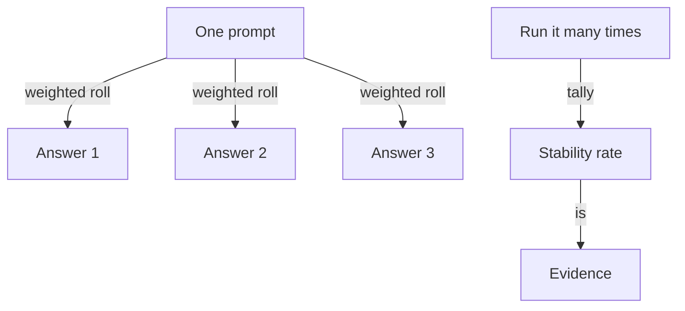

**The idea in one line:** a model rolls weighted dice for every chunk, so one right answer proves little; run it many times.

Ask a model the same question twice and you may get two different answers. Sometimes the wording differs, sometimes the conclusion does.

In ordinary programming, the same input gives the same output, so this feels like a bug. It is a design choice, and it changes how you test everything.

A model does not produce one next chunk. It scores every possible chunk, which becomes probabilities: "the" is quite likely, "banana" almost impossible. Choosing among them is called **sampling**, and it is a weighted roll.

Here is the analogy. Imagine a die with thousands of faces, where likelier chunks take up more of the surface. Most rolls land on a favourite, but a less likely face turns up now and then. Next time you ask, the die is rolled again.

Early rolls matter most. Once one chunk is chosen, every later prediction builds on it, so a different early roll sends the whole answer down a different road.



```interactive
widget: sampling
```

Many tools expose a setting called **temperature**, which controls how loaded the die is:

- **Low temperature** squeezes the odds toward the favourite. Answers are steadier and more repetitive.
- **High temperature** flattens the odds. Answers are more varied, sometimes odder.

Even at the lowest setting, results can wobble a little. Treat "identical every time" as something to verify, never assume.

For brainstorming names, you want the die. For deciding whether a posting is remote, you want the same answer every time, or a known rate of disagreement.

> A system that is right once is not yet a system. Stability across many runs is evidence. A lucky run is an anecdote.

## Real-world example: the rerun that doubled our rows

Our pipelines process large batches of job postings overnight. In the early builds, a second run did not leave the database the way the first had. Reruns created duplicate rows.

Those duplicates came from our own code writing the same record again, not from the dice. But a rerun can go wrong in two ways:

- The code repeats itself, as ours did.
- The model answers differently the second time, so "the same run" produces different data.

So we wrote a doctrine. Run the pipeline twice, then compare the database before and after. They should match, or differ in ways you can explain.

Then kill the pipeline halfway through a run, restart it, and check that resuming corrupts nothing: no double rows, no half-written ones. Until a pipeline passes both checks, we do not count it as built.

## See it yourself (2 minutes)

Open your agent or any AI chat. Start a fresh conversation for each try, or use the regenerate button, and send this same message five times:

> Job title: "Junior Data Analyst, hybrid, London office 2 days a week."
> Is this job remote? Answer with exactly one word: yes, no, or partly.

Tally your five answers. If they all agree, try a murkier title, such as "Customer Success Lead, flexible location, some travel."

The posting where answers split is the one a real pipeline needs extra care for.

## What this means when you build

From your first mission, you run each build more than once and keep the results side by side.

- Your prediction sheet includes a stability line: if I run this ten times, how many answers will match?
- You meet the run-twice check as an explicit gate in later missions.

Treat the first correct answer as a hypothesis. The pattern across ten runs is the finding.

## Check yourself

You run your pipeline twice and find duplicate rows. The model's answers were identical both times, and you had set temperature to its lowest. Is sampling the culprit, yes or no? What is?

<details><summary>Decide on your answer, then open</summary>

No. Identical answers rule the dice out, and the duplicates came from our own code writing the same record again. A rerun can go wrong two ways, repeated code or a different model answer, so you check the database before and after a second run and after a mid-run kill.

</details>
