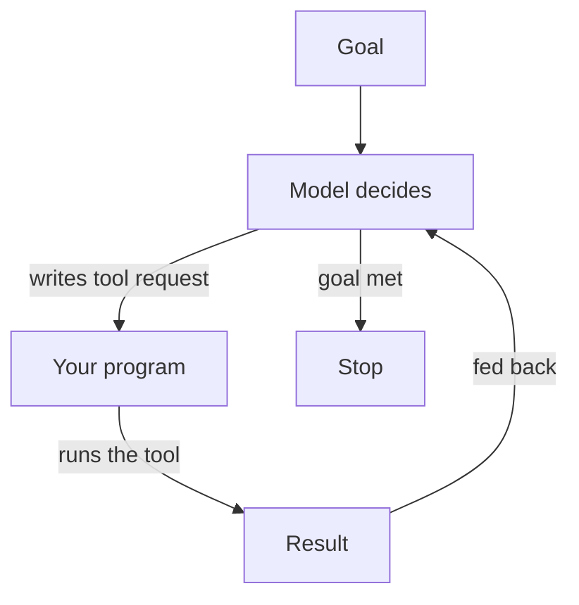

**The idea in one line:** an agent is a goal, some tools and a loop, so its mistakes become actions.

A chatbot takes text in and gives text back. Nothing in the world changes until a human reads it and acts. An **agent** is a model that can do things itself, made of three pieces: a goal, some tools, and a loop.

A **tool** is a function the model is allowed to call: look up a record, fetch a page, send a message, change a database row. The model doesn't run it. It writes a request like "call the search tool with these words," and a program you wrote runs it and hands back the result. To the model, a tool is just more text arriving mid-conversation.

The **loop** makes it an agent rather than a one-shot question:

- The model looks at the goal and what it knows so far.
- It picks a tool and calls it, then reads the result.
- It decides what to do next, repeating until the goal is met or something stops it.

Here's the analogy. A pen pal and a house-sitter both receive your instructions. Ask a pen pal "the plants look thirsty?" and you get a thoughtful letter while the plants stay thirsty. Give a house-sitter a key and the goal "keep the plants alive while I'm away," and they check the soil, water, and look again tomorrow. Same intelligence. What changed is the key and the ability to return.



```interactive
widget: agent-loop
```

> A wrong chatbot answer misleads a reader who can check. A wrong agent
> action has already happened by the time anyone looks.

That's why the rest of this cluster (budgets, approval gates, safe reruns) answers one question that only exists once you hand over the key: what is this thing allowed to do when nobody is watching?

## Real-world example: the agent that watches the board

This is also the first mission you'll build, so here it is from the builder's side. Our job-watch agent reads the live board through a tool, decides which postings matter for what it's watching, and acts on that decision.

Each piece is plain. The goal is a sentence a person could say aloud. The tool is the only way the agent sees the board, so it carries no copy of the postings and doesn't guess what's open today. The loop lets it look, decide, and look again as the board changes.

The agent is only as honest as its tool. If the tool returns a stale listing, the agent acts on a stale listing, and every later decision inherits the mistake.

There's no scar here, and that's the point. A goal, a tool that reads real data, a loop that decides what next. If you can say those three things about a system, you've described an agent.

## See it yourself (2 minutes)

In any AI chat, ask it to play out the loop on paper:

> Act as an agent with one tool: search_jobs(keyword), which returns a list of job titles. My goal is: find me one remote data role. Write out your loop step by step. At each step show what you think, which tool call you would make, and then wait. I'll paste in fake tool results. Start now.

Paste "search_jobs('data') returned: Data Analyst (onsite), Data Engineer (remote)" and watch what it does next. Then feed it a misleading result and see it act on it. That's the leap, in miniature.

## What this means when you build

Your warm-up mission is an agent with one tool and a clear goal, and the point is to watch the loop run. Before building, write down what you expect each step to be, and which action could do harm if the agent got it wrong. That list of actions with consequences drives every safety decision in later projects.

## Check yourself

Our job-watch agent reads the live board through a tool. If that tool returns a stale listing, what does the agent do with it, and what does that tell you about where to put your verification effort?

<details><summary>Decide on your answer, then open</summary>

The agent acts on the stale listing as if it were true, and every later decision in the loop inherits the mistake, because the model only knows what the tool tells it. So verification belongs on what the tool returns, not only on what the model decides.

</details>
