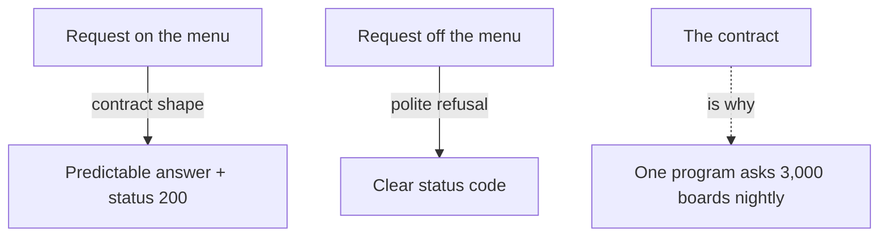

**The idea in one line:** an API is a written promise about how to ask a program for something and what comes back.

An **API** (application programming interface) is a way for one program to ask another for something, in a form both sides agreed on beforehand. It is a published list of what you may ask, how to phrase it, and what you'll get back.

A few words come with it:

- **Request:** the question you send.
- **Response:** the answer.
- **Endpoint:** the place you send the request. It is a web address that answers questions instead of showing you a page.
- **JSON:** a plain-text format for organised data, like `{"title": "Data Analyst", "remote": true}`. Labels on the left, values on the right.
- **Status code:** a number saying how it went. 200 means fine, 404 means that thing doesn't exist, 429 means you're asking too fast.

Here's the analogy. A restaurant has a menu and a kitchen window. The menu is the documentation. You order what's on it, the way the restaurant takes orders, and what comes out looks like the picture.

You never see the kitchen. The restaurant can change its cooks, stove and suppliers, and as long as the dish matches the menu you're none the wiser. Order something off the menu and you get a polite no, which beats a surprise.

> An API is a **contract**: a written promise that the answer will have a certain shape. Your program trusts the promise, and the other program keeps it.

## Real-world example: three thousand boards, one question

This is how our job board stays fresh. Every night a **crawler** (a program that visits many sites in a row and collects what it finds) asks about 3,000 company job boards the same question: which jobs do you have open right now?

Nobody at most of those companies knows we exist. We haven't phoned them or signed anything, and none will be awake when we ask. It works anyway, because the boards publish answers in a predictable shape, and we ask only for what the menu offers. The crawler reads the fields it expects, such as title and location, and files them in our database.

That predictability is the entire asset. Take the contract away and the same job takes people, not a program.

It also tells you where to look when something goes wrong. A board can keep its promise about the shape and break it about the meaning. The next note covers exactly that.

## See it yourself (2 minutes)

You can play both sides of an API in any AI chat. Paste this:

> Pretend you are the API for a small library. Reply ONLY in JSON and always include a status code. The menu is: search books by title, get one book by id. Nothing else. I'll send requests now. First: search for "garden". Then: get book 7. Then: delete book 7. Then: tell me a joke.

Watch the last two. A well-behaved API answers an off-menu request with a clear refusal and a status code. If your library tells a joke, you've seen what a program without a contract does: it answers anyway, and you can't predict the shape.

Then send an on-menu request spelled badly: `get book seven`. Real APIs are strict about this, and the strictness is a feature.

## What this means when you build

In the warm-up mission you'll build an agent that watches our live job board. It reads the board through an API call: send a request, get JSON back, reason about it. A model is also reached through an API, so every time your agent "thinks", that is a request and a response too.

Before wiring anything up, read the menu. Find the endpoint, the fields it promises, and the status codes it can return. Then write down one thing the menu does not promise. That gap is where your first surprise will come from.

## Check yourself

If a person had to check each of the 3,000 job boards by hand at five minutes a board, how long would one nightly pass take, and what makes the program able to do it instead?

Decide on your answer, then open

About 250 hours, which is more than ten days of nonstop work for a single pass. The program manages it because every board publishes its answers in a predictable shape, so no one has to squint at each one. That shared contract is the whole asset.

